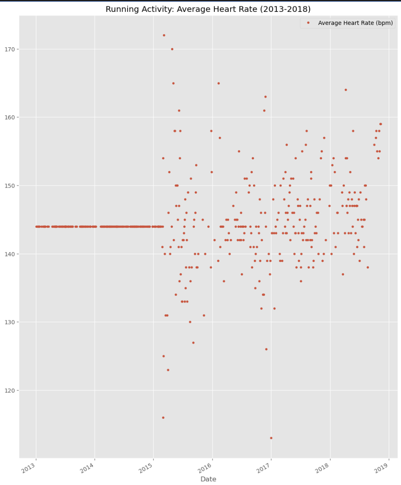
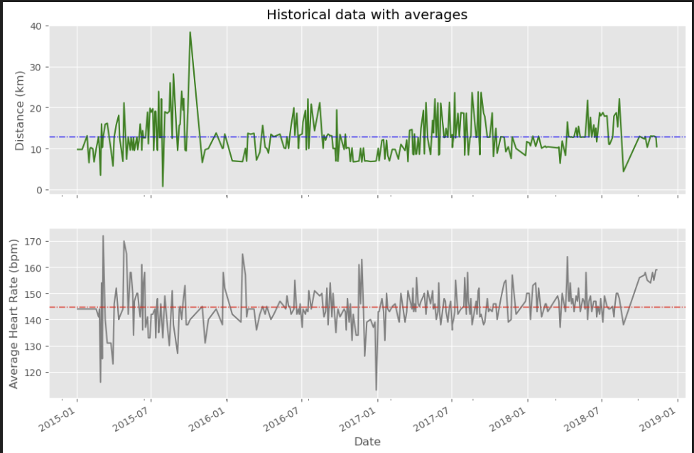
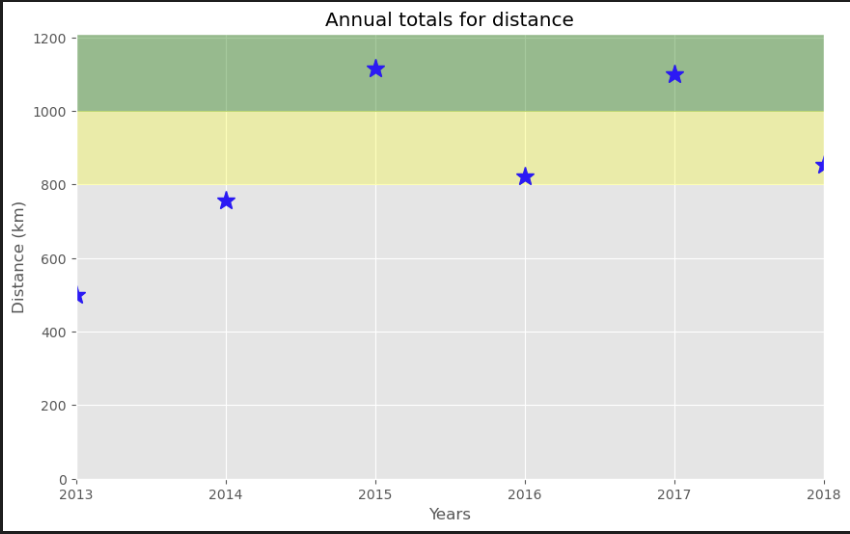
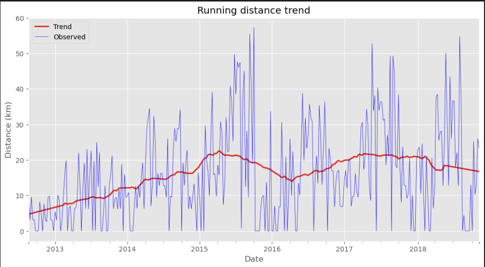
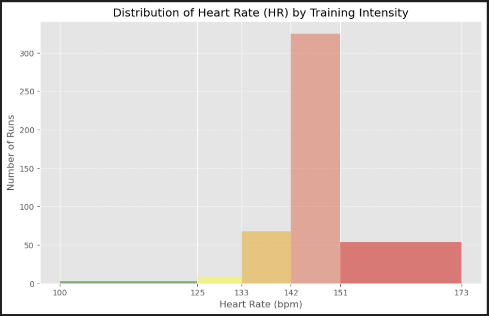

# Analyzing 6 Years of GPS Fitness Tracker Data

An exploratory data analysis of personal running data (2012–2018) exported from [Runkeeper](https://runkeeper.com/), covering data cleaning, visualization, trend analysis, and goal tracking.

## Dataset
- **508 activities** spanning August 2012 to November 2018
- Activity breakdown: Running (459), Cycling (29), Walking (18), Unicycling (2)
- Key features: Distance (km), Duration, Average Pace, Average Speed (km/h), Climb (m), Average Heart Rate (bpm)
- Source: Runkeeper CSV export (`cardioActivities.csv`)

## Tools
Python · Pandas · Matplotlib · Statsmodels

## Data Cleaning & Preprocessing

Before analysis, several preprocessing steps were applied:
- **Dropped unused columns:** `Route Name`, `GPX File`, `Activity Id`, `Calories Burned`, `Notes`, `Friend's Tagged` — these were either empty or irrelevant to the analysis
- **Renamed activity types:** "Other" was replaced with "Unicycling" based on domain knowledge
- **Handled missing values:** 214 missing heart rate entries were filled using mean imputation grouped by activity type (Running, Cycling, Walking), since heart rate varies significantly across different exercises
- **Parsed dates:** The `Date` column was converted to a `DatetimeIndex` to enable time series analysis and resampling

## Analysis & Findings

### 1. Running Metrics Over Time (2013–2018)
The first step was plotting raw running data across time to spot patterns and anomalies. Average heart rate was visualized as a scatter plot over the full date range to identify periods where a cardio sensor was or wasn't used.

**Key insight:** Heart rate data is only consistently available from 2015 onward, as a cardio sensor wasn't always used before that.

<!-- Save the Average Heart Rate scatter plot (Task 4) as images/running_metrics.png -->


---

### 2. Running Statistics (2015–2018)
Using only the 2015–2018 subset (when heart rate data was reliable), annual and weekly statistics were computed via Pandas `resample()`.

| Metric | Value |
|---|---|
| Average weekly training sessions | 1.5 |
| Average distance per run | ~11.4 km |
| Average speed | ~11.0 km/h |
| Average heart rate | ~145 bpm |

**Key insight:** Training frequency averaged about 1.5 sessions per week — consistent but with room for improvement.

---

### 3. Distance & Heart Rate with Long-Term Averages
Raw distance and heart rate data were plotted alongside their overall averages (shown as dashed horizontal lines) to compare individual sessions against the long-term baseline.

**Key insight:** Most runs cluster around the average distance (~11 km), while heart rate shows a slight upward trend in later years, possibly indicating changes in training intensity or fitness level.

<!-- Save the two-subplot figure with average lines (Task 6) as images/averages_plot.png -->


---

### 4. Annual Distance vs Goal
A personal target of **1,000 km per year** was set to stay motivated. Annual distance totals were plotted with colored zones:
- 🟢 Green zone (≥1,000 km): Goal achieved
- 🟡 Yellow zone (800–1,000 km): Close but not quite

**Key insight:** The goal was reached in some years but not all — consistency across years is the biggest challenge.

<!-- Save the annual totals plot with green/yellow zones (Task 7) as images/annual_totals.png -->


---

### 5. Weekly Distance Trend (Decomposition)
To answer "Am I progressing?", the weekly running distance was decomposed using `statsmodels` seasonal decomposition. The red trend line shows the underlying long-term pattern, while blue shows the raw observed data.

**Key insight:** The trend reveals periods of ramp-up and decline, highlighting how training volume fluctuates with seasons, motivation, and life events.

<!-- Save the trend decomposition plot (Task 8) as images/weekly_trend.png -->


---

### 6. Heart Rate Distribution by Training Zone
Heart rate data was bucketed into standard training zones to understand training intensity distribution:

| Zone | HR Range (bpm) | Color |
|---|---|---|
| Easy | 100–125 | 🟢 Green |
| Moderate | 125–133 | 🟡 Yellow |
| Hard | 133–142 | 🟠 Orange |
| Very Hard | 142–151 | 🔴 Tomato |
| Maximal | 151–173 | 🔴 Red |

**Key insight:** The majority of runs fall in the Moderate to Hard zones, suggesting a balanced approach between endurance building and intensity training.

<!-- Save the color-coded HR histogram (Task 9) as images/hr_zones.png -->


---

### 7. Summary Report

**Totals by Activity Type:**

| Activity | Total Distance (km) | Total Climb (m) |
|---|---|---|
| Running | 5,224.50 | 57,278 |
| Cycling | 680.58 | 6,976 |
| Walking | 33.45 | 349 |

**Running averages:** ~11.4 km/run at ~11.0 km/h with ~125 m of climb per session.

## Quick Stats

| Metric | Value |
|---|---|
| Total runs | 459 |
| Total km run | 5,224 km |
| Longest run | 38.32 km |
| Highest climb | 982 m |
| Total climb | 57,278 m |
| Shoes used | 7 pairs |
| Avg km per shoe | ~746 km |

### 🏃 Forrest Gump Comparison
Forrest Gump's legendary run covered 24,700 km over 1,169 days. At the same shoe-wear rate (~746 km per pair), he would have needed approximately **33 pairs of running shoes!**
```

Run all cells sequentially to reproduce the full analysis.
